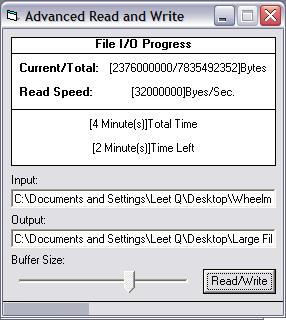



## Advance Multi GB file Read/Write

### Description

I made this little project to find a way to read and/or write files that

are multi gigs in size. I tried to use the the "Open.. for.. access.."

that VB6 has and it errors out due to an overflow. You can't even use

the eof() and lof() function VB6 has because they will just error and

overflow. Try it yourself. Try using LOF() to get the length of a file

that is 8 GB's in size, it just will not do it. So I hope this helps

some people out. It's just an example of a use for this. I'm sure those

whose eye this post catches will find many uses for it. Happy Coding.
 
### More Info
 

             |
---                |---
**Submitted On**   |2009-04-24 00:35:16
**By**             |[Leet Q](https://github.com/Planet-Source-Code/PSCIndex/blob/master/ByAuthor/leet-q.md)
**Level**          |Intermediate
**User Rating**    |5.0 (35 globes from 7 users)
**Compatibility**  |VB 6\.0
**Category**       |[Files/ File Controls/ Input/ Output](https://github.com/Planet-Source-Code/PSCIndex/blob/master/ByCategory/files-file-controls-input-output__1-3.md)
**World**          |[Visual Basic](https://github.com/Planet-Source-Code/PSCIndex/blob/master/ByWorld/visual-basic.md)
**Archive File**   |[Advance\_Mu2150554242009\.zip](https://github.com/Planet-Source-Code/leet-q-advance-multi-gb-file-read-write__1-72025/archive/master.zip)

